  

###

<h2 align="left">Full Stack Engineer · Distributed Systems · AWS · Pune, India</h2>

###

<h4 align="left">I build production-grade backend systems fintech APIs, real-time schedulers, and cloud infrastructure that runs at scale.  
Backend engineer, building end-to-end fintech infra (tRPC, PostgreSQL, AWS) 
Engineered the scheduling layer for India's 2nd largest automated parking system (14 floors, 6 lifts, 700 spots) 
SIH 2024 Winner ISRO track · IIT Jodhpur E-Conclave 1st Place 

###

  
  

## 🚀 Projects

| Project | Description |
|--------|-------------|
| [**Infrawatch**](https://github.com/SohamRupaye/Infrawatch) | Self-hosted infra monitoring in Go — goroutine health polling, circuit breakers, state machines, TimescaleDB, multi-channel alerting. |
| [**LaunchKit**](https://github.com/SohamRupaye/LaunchKit) | Auto-detects project structure and generates production-ready Dockerfiles, K8s manifests, CI/CD pipelines, and Nginx configs. |
| [**AuthKit**](https://github.com/SohamRupaye/AuthKit) | Production-ready FastAPI authentication framework with clean, extensible architecture. |
| [**Fullstack Template**](https://github.com/SohamRupaye/fullstack-template) | A full-stack monorepo starter with TypeScript, tRPC, and PostgreSQL. |

###

  
  
  
  
  

###

<picture>
  <source media="(prefers-color-scheme: dark)" srcset="https://raw.githubusercontent.com/QuirkyDevil/QuirkyDevil/output/pacman-contribution-graph-dark.svg">
  <source media="(prefers-color-scheme: light)" srcset="https://raw.githubusercontent.com/QuirkyDevil/QuirkyDevil/output/pacman-contribution-graph.svg">
  
</picture>

###

  

